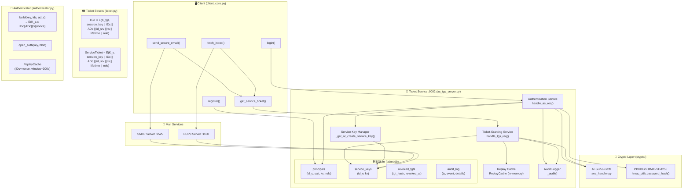
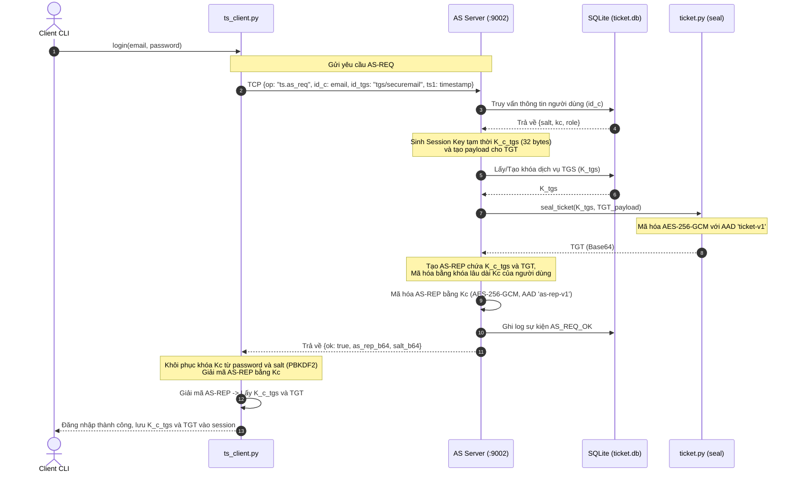
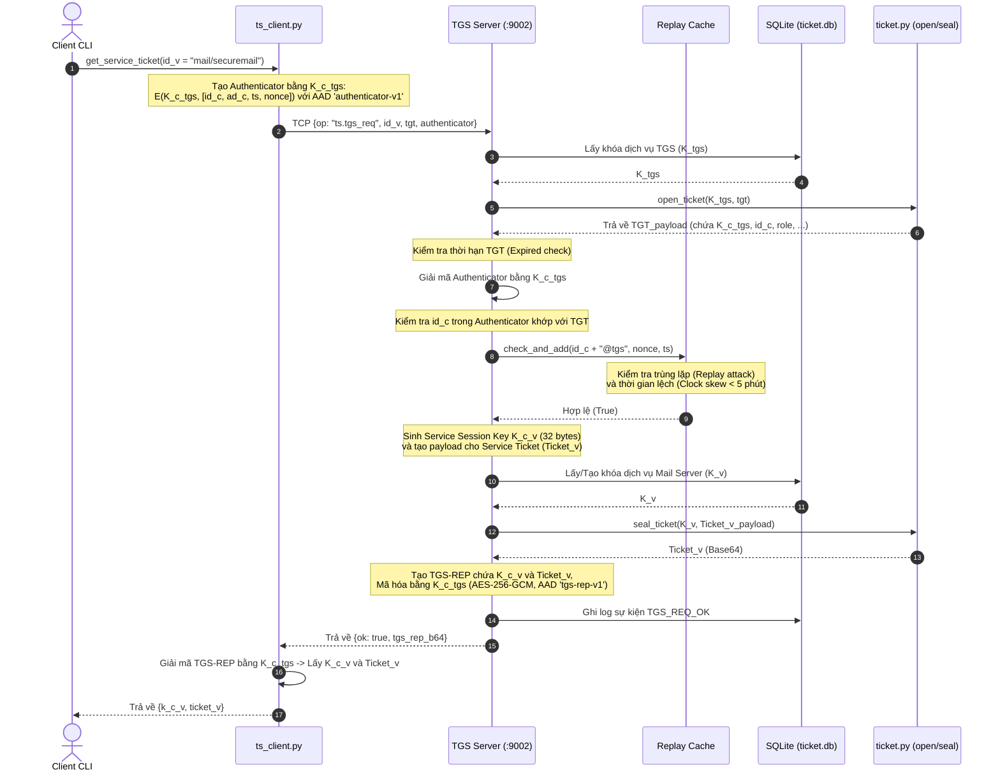
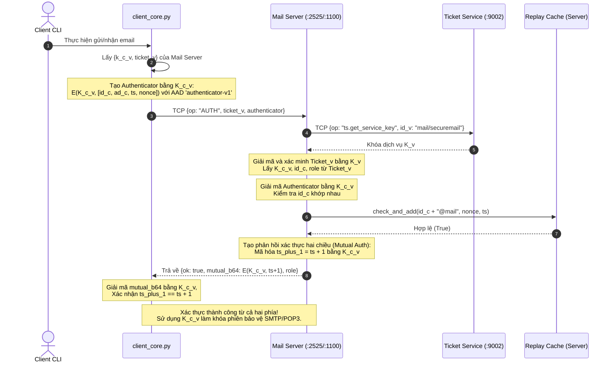
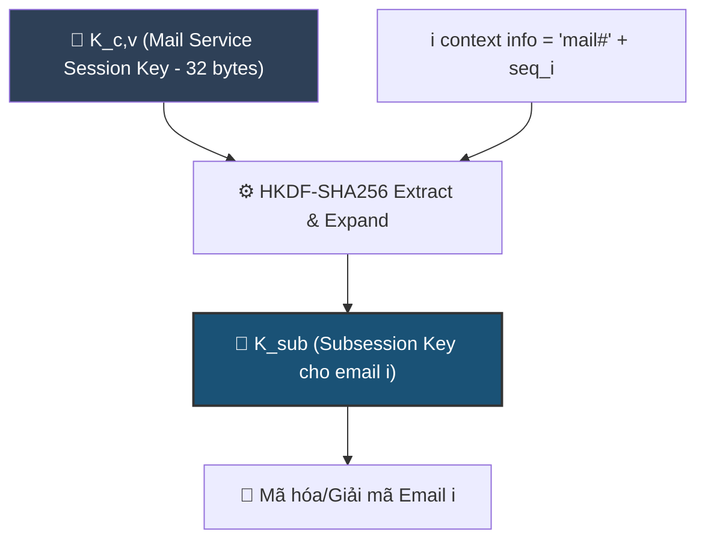
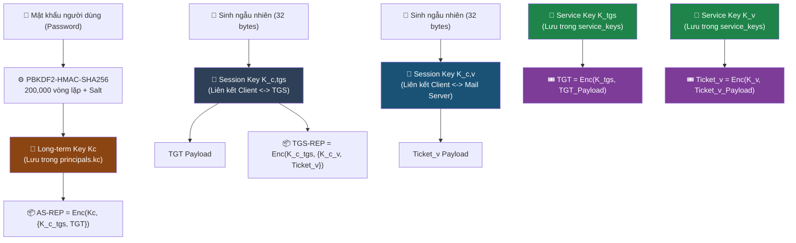

# Biểu Đồ Mermaid cho Kerberos-Lite trong SecureMail

Tài liệu này chứa các biểu đồ Mermaid thể hiện cấu trúc và luồng hoạt động của giao thức **Kerberos-lite** được triển khai trong dự án SecureMail, bao gồm các dịch vụ **Authentication Service (AS)**, **Ticket-Granting Service (TGS)** và các giao tiếp với **Mail Server (SMTP/POP3)**.

---

## 1. Kiến Trúc Tổng Quan (Component Diagram)

Biểu đồ dưới đây thể hiện các thành phần tham gia vào luồng Kerberos-lite và mối quan hệ giữa chúng.

---

## 2. Giao Thức Đăng Nhập & Lấy TGT (AS Exchange)

Luồng trao đổi giữa Client và Authentication Service (AS) để lấy **Ticket-Granting Ticket (TGT)**.

---

## 3. Giao Thức Yêu Cầu Vé Dịch Vụ (TGS Exchange)

Luồng trao đổi giữa Client và Ticket-Granting Service (TGS) để lấy **Service Ticket (Ticket_v)**.

---

## 4. Xác Thực Hai Chiều Với Mail Server (Service Exchange - Mutual Auth)

Luồng xác thực giữa Client và Mail Server sử dụng Service Ticket đã lấy từ TGS.

---

## 5. Dẫn Xuất Khóa Phiên Phân Cấp (Hierarchical Key - HKDF)

Để tăng cường bảo mật, hệ thống không sử dụng trực tiếp $K_{c,v}$ cho mọi email. Thay vào đó, một **Subsession Key** được dẫn xuất cho mỗi email riêng biệt:

---

## 6. Sơ Đồ Phân Cấp Khóa (Key Hierarchy)

Tất cả các khóa được sử dụng trong Kerberos-lite và mối liên hệ giữa chúng.

